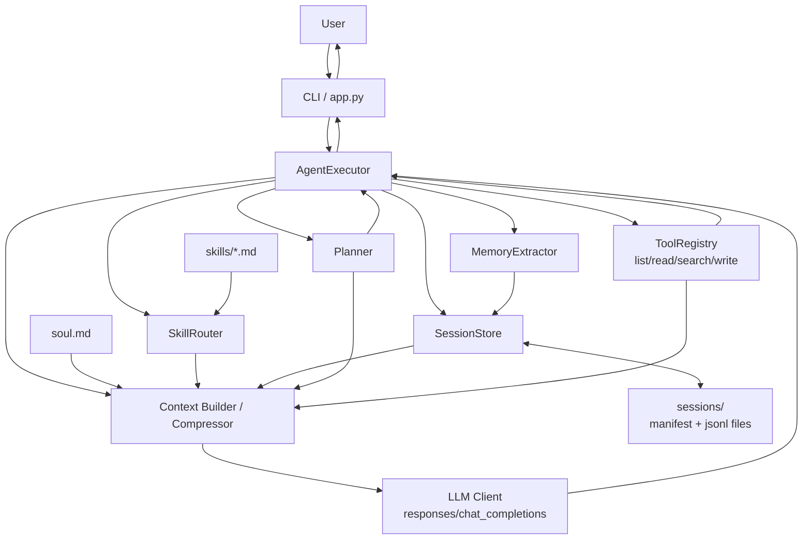
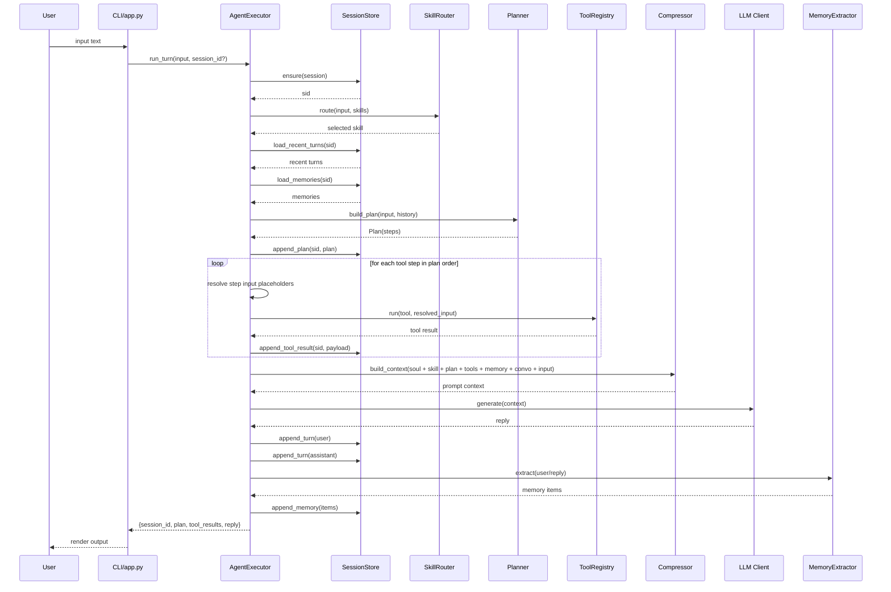

# Architecture Diagrams (Mermaid)

下面两张图用于展示 SkillIt 的整体架构与单轮请求流转。

## 1) Overall Architecture

## 2) Single-Turn Runtime Sequence

## 3) Notes

- 计划是强制阶段：每轮都先 `build_plan`，再执行工具步骤。
- 工具步骤支持串行依赖：后一步可引用前一步结果（如 `{{last_search_hit_file}}`）。
- 所有状态可审计：turn/plan/tool/memory 都会落盘到 `sessions/<sid>/`。
